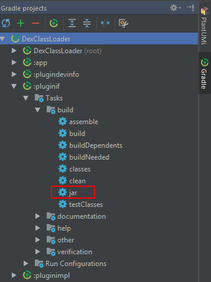

动态加载jar包
--------


### 概述

前段时间在开发外设驱动程序时，涉及到了动态加载jar包的知识，于是开始学习了下。

这里主要是完成客户端驱动jar包代码编写，所以只涉及到java接口实现问题，然后将jar包经过dex转换，放到测试程序的指定目录下即可进行驱动测试。


### 将jar包转换成dex编码格式

Android中Dalvik/ART虚拟机能够直接加载的是dex文件。

使用dx命令将导出的驱动jar包转为dex编码格式，扩展名还是保持为jar不变即可。

```bash
// dx  -- 如27.0.3版本为Android\Sdk\build-tools\27.0.3下的dx.bat脚本
// XXX.jar  -- 为转换后的文件名，仍保持扩展名为jar
// XXX-origin.jar  -- 要进行转换前的jar包
dx --dex --output=XXX.jar XXX-origin.jar
```


### 加载经过dex转码后的jar包

Android中使用DexClassLoader来动态加载指定路径下的经过dex转化过的jar包或apk文件。

DexClassLoader类只有一个构造方法参数说明
```java
// dexPath  -- 经dex优化的jar包/apk存放路径
// optimizedDirectory  -- 解压出的dex文件的存放路径，不可存放在外置存储，以免被注入攻击
// librarySearchPath  -- C/C++依赖的本地库文件目录，可以为null
// parent  -- 父类的类加载器
public DexClassLoader(String dexPath, String optimizedDirectory, String librarySearchPath, ClassLoader parent);
```

获取DexClassLoader实例
```java
private DexClassLoader getClassLoader(String paramString) {
    String dexPath = new File(getAppJarDir(), paramString).getAbsolutePath(); // 经过dex转码后的jar包存放路径
    String optimizedDirectory = getAppDexDir().getAbsolutePath(); // dex优化文件存放路径
    String librarySearchPath = getAppLibDir().getAbsolutePath(); // 本地依赖库存放路径
    ClassLoader parent = getClassLoader(); // 父类的类加载器
    return new DexClassLoader(dexPath, optimizedDirectory, librarySearchPath, parent);
}
```


### 调用dex里面的代码

这里可以使用两种方式来调用dex里面的代码：
- 通过接口实现方式
- 通过反射机制方式

##### 通过接口实现方式

将方法抽象成公共接口，并制作成jar包，直接用于开发驱动jar包和驱动测试程序。

测试程序中可以直接对加载后的类实例进行强制类型转换来直接调用方法。

接口定义如下：
```java
// (Java Library)
// pluginif/src/main/java/com.shellever.plugin/PluginIf.java

package com.shellever.plugin;

public interface PluginIf {
    String getDeviceInfo();
}
```

接口实现如下：
```java
// (Java Library)
// pluginimpl/src/main/java/com.shellever.plugin/PluginImpl.java

package com.shellever.plugin;

public class PluginImpl implements PluginIf {
    @Override
    public String getDeviceInfo() {
        return "Shellever";
    }
}
```

测试程序中动态调用方式如下：
```java
// (Phone)
// app/src/main/java/com.shellever.dexclassloader.MainActivity.java

public void testDexClassLoaderWithIf() {
    // 加载接口具体实现的经过dex转换过的jar包
    DexClassLoader dexClassLoader = getClassLoader("pluginImpl.jar");
    try {
        // 加载接口具体实现类
        Class pluginImplClazz = dexClassLoader.loadClass("com.shellever.plugin.PluginImpl");
        PluginIf pluginIf = (PluginIf) pluginImplClazz.newInstance();   // 直接强制类型转换
        String devInfo = pluginIf.getDeviceInfo();  // 调用接口方法
        mLoaderResultTv.setText(devInfo);
    } catch (ClassNotFoundException e) {
        e.printStackTrace();
    } catch (IllegalAccessException e) {
        e.printStackTrace();
    } catch (InstantiationException e) {
        e.printStackTrace();
    }
}
```

##### 通过反射机制方式

通过文档接口约定来编写驱动时，在测试程序中只能通过反射的方法来调用接口方法了。

驱动实现代码如下：
```java
// (Phone)
// app/src/main/java/com.shellever.dexclassloader.MainActivity.java

package com.shellever.plugin.common;

import android.content.Context;

public class Common {

    private Context mContext;

    public Common(Context context){
        mContext = context;
    }

    public String getDeviceInfo(){
        return "Shellever.HPF";
    }
}
```

测试程序这边考虑到多模块驱动时，保证接口的正确性和程序的可扩展性，通过xml文件对模块接口进行定义：
```xml
// app/src/main/res/xml/device_class_module.xml

<?xml version="1.0" encoding="utf-8"?>
<devices>
    <modules>
        <module id="COMMON" name="com.shellever.plugin.common.Common" args="Context"/>
    </modules>
    <functions>
        <function id="COMMON" name="getDeviceInfo" args=""/>
    </functions>
</devices>
```

其中的标签及属性定义说明：
modules用于定义模块集合；
module用于模块类路径及构造方法的定义，id为模块名称，name为模块类全路径，args为构造方法参数类型。
functions为具体模块的方法声明；
function用于具体方法声明，id为指定所属模块，name为方法名称，args为方法参数类型。

测试程序中xml解析代码如下：
```java
public HashMap<String, DeviceInfo> parseDeviceInfo(){
    HashMap<String, DeviceInfo> deviceInfo = new HashMap<>();
    XmlResourceParser parser = getResources().getXml(R.xml.device_class_module);
    try {
        int eventType = parser.getEventType();
        while(eventType != XmlPullParser.END_DOCUMENT){
            switch (eventType){
                case XmlPullParser.START_TAG:
                    if("module".equals(parser.getName())){
                        DeviceInfo localDeviceInfo = new DeviceInfo();
                        localDeviceInfo.name = parser.getAttributeValue(null, "name");
                        localDeviceInfo.args = parser.getAttributeValue(null, "args");
                        deviceInfo.put(parser.getAttributeValue(null, "id"), localDeviceInfo);
                    }
                    if("function".equals(parser.getName())){
                        DeviceInfo localDeviceInfo = new DeviceInfo();
                        localDeviceInfo.name = parser.getAttributeValue(null, "name");
                        localDeviceInfo.args = parser.getAttributeValue(null, "args");
                        deviceInfo.put(parser.getAttributeValue(null, "id") + localDeviceInfo.name, localDeviceInfo);
                    }
                    break;
            }
            eventType = parser.next();
        }
    } catch (XmlPullParserException e) {
        e.printStackTrace();
    } catch (IOException e) {
        e.printStackTrace();
    }
    return deviceInfo;
}

public class DeviceInfo {
    public String args;
    public String name;
}
```

测试程序中动态调用代码如下：
```java
public void testDexClassLoaderWithReflect() {
    HashMap<String, DeviceInfo> deviceInfo = parseDeviceInfo(); // 解析xml定义文件

    // 加载接口具体实现的经过dex转换过的jar包
    DexClassLoader dexClassLoader = getClassLoader("pluginDevInfo.jar");
    // 获取COMMON模块构造方法及参数
    DeviceInfo localDeviceInfo = deviceInfo.get("COMMON");
    String className = localDeviceInfo.name;
    String classArgs = localDeviceInfo.args;
    Log.d(TAG, "className = " + className);

    // 获取COMMON模块接口方法及参数
    DeviceInfo localDeviceInfo2 = deviceInfo.get("COMMON" + "getDeviceInfo");
    String functionName = localDeviceInfo2.name;
    String functionArgs = localDeviceInfo2.args;
    Log.d(TAG, "functionName = " + functionName);
    try {
        Class pluginDevInfoClazz = dexClassLoader.loadClass(className);
        Object localObject = pluginDevInfoClazz.getConstructor(getParamType(classArgs)).newInstance(new Object[]{this});
        Method localMethod = localObject.getClass().getDeclaredMethod(functionName, getParamType(functionArgs));
        String returnType = localMethod.getReturnType().getSimpleName(); // 获取方法返回值类型
        if("String".equals(returnType)){
            // 通过反射调用接口方法
            String devinfo = (String) localMethod.invoke(localObject, new Object[0]);
            mLoaderResultTv.append("\n" + devinfo);
        }
    } catch (ClassNotFoundException e) {
        e.printStackTrace();
    } catch (NoSuchMethodException e) {
        e.printStackTrace();
    } catch (IllegalAccessException e) {
        e.printStackTrace();
    } catch (InstantiationException e) {
        e.printStackTrace();
    } catch (InvocationTargetException e) {
        e.printStackTrace();
    }
}
```


### 导出jar包方式

Eclipse导出jar包比较简单，详细步骤可以参考这里： **[使用eclipse工程导出jar包](https://blog.csdn.net/changqing5818/article/details/52062790)**

Android Studio中创建Java Library (Android Library会同时创建资源文件及目录)默认会创建jar任务，直接双击运行即可生成jar包。



当创建模块是app应用程序时，则需要手动编写Gradle任务来将编译生成的class文件打包成jar包：
```gradle
// plugindevinfo模块打jar包任务
// Phone
task clearJar(type: Delete) {
    // 编译完成后jar包存放位置
    delete 'build/libs/pluginDevInfo.jar'
    delete 'libs/pluginDevInfo.jar'
}
//打包任务
task makeJar(type: Jar) {
    //指定生成的jar名
    baseName 'pluginDevInfo'
    //从哪里打包class文件
    from('build/intermediates/classes/release/com/shellever/plugin')
    //打包到jar后的目录结构
    into('com/shellever/plugin/')
    //去掉不需要打包的目录和文件
    exclude('BuildConfig.class', 'R.class')
    //去掉R$开头的文件
    exclude { it.name.startsWith('R$') }
}
makeJar.dependsOn(clearJar, build)
```

### 参考文章
**[使用eclipse工程导出jar包](https://blog.csdn.net/changqing5818/article/details/52062790)**

**[AS生成jar包，并在其他工程中引用jar包的方法](https://www.jianshu.com/p/9c42da316bd1)**

**[Android动态加载入门 简单加载模式](https://segmentfault.com/a/1190000004062952)**